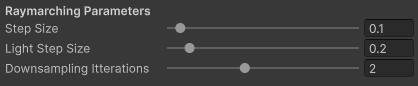
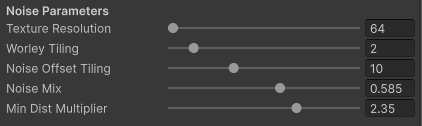
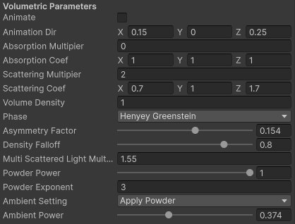

# Raymarched Volumetric
This project focuses on rendering **participating media(clouds, fog, etc.)** using **volumetric raymarcher**, while trying to make it as **customizable** and **physically accurate** as possible.

## Options Overview
### Raymarching Parameters

### Noise Parameters

### Volumetric Parameters

### Final Output

## Optimization Techniques Used
* Compute shader based raymarching calculations
* Adjustable, itterative downsampling of render texture for compute shader
* Adjustable resolution for 3D noise texture
* Reduction of "exp()" function calls using exponent power rule
* Early termination based on transmittance
* Max steps limits for volume and light raymarching

## Resources Used
 - [Acerola](https://youtu.be/ryB8hT5TMSg?si=8OAnO4RpsvCn7oA6)
 - [Sebastian Lague](https://youtu.be/4QOcCGI6xOU?si=MbLOhz84CBwUdQNo)
 - [Scratch A Pixel](https://www.scratchapixel.com/lessons/3d-basic-rendering/volume-rendering-for-developers/intro-volume-rendering.html)
 - [The Real-time Volumetric Cloudscapes of Horizon: Zero Dawn](https://advances.realtimerendering.com/s2015/The%20Real-time%20Volumetric%20Cloudscapes%20of%20Horizon%20-%20Zero%20Dawn%20-%20ARTR.pdf)
 - "Chapter 14 Volumetric and Translucency Rendering" from "Real-time Rendering 4"
